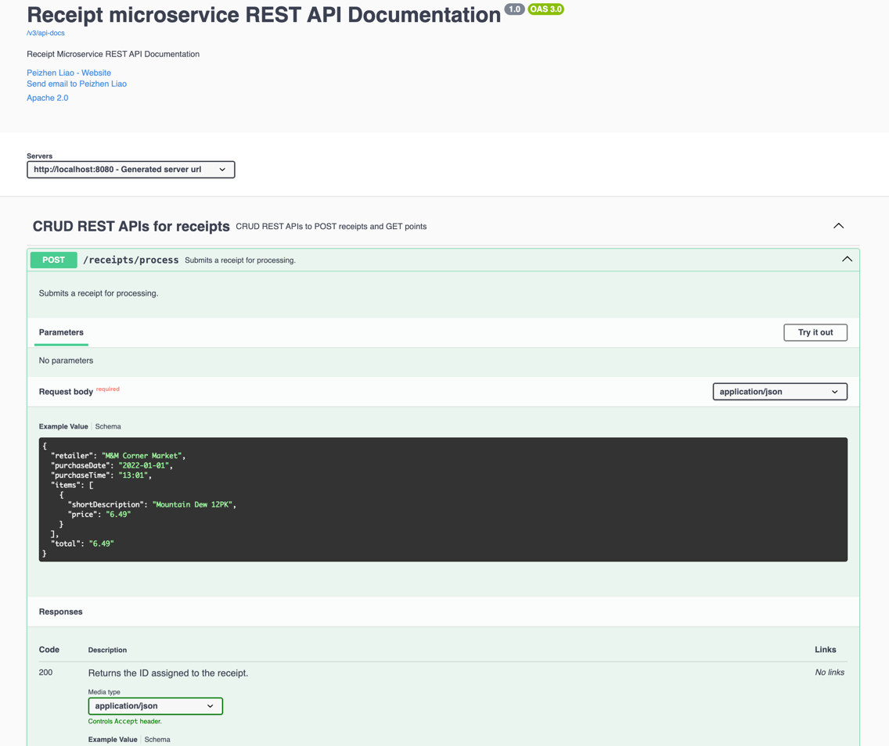

# Receipt Processing Web Service

## Overview

This project is a web service that processes receipts and calculates reward points based on predefined rules. The 
API follows the provided `api.yml` specification. The default port is 8080.

## Tech Stack

- Java 17
- Spring Boot
- Spring Data JPA
- Swagger UI

## Features

- Accepts a JSON receipt and returns a generated receipt ID.
- Calculates reward points based on predefined rules.
- Provides a `GET` endpoint to retrieve points for a specific receipt ID.
- Uses in-memory storage(h2) to persist the data.

## Requirements

- **Docker** 

## Installation & Running

1. Clone the repository:

   ```sh
   git clone git@github.com:peggrio/Fetch_receipt_take_home.git
   cd Fetch_receipt_take_home/receipt/

2. Build and run the Docker container:

   ```sh
   docker build . -t <your_docker_username>/receipt:v1
   docker run -p 8080:8080 <your_docker_username>/receipt:v1

## API Documentation

After running the container, visit [Swagger UI](http://localhost:8080/swagger-ui/index.html)
for detailed api design



